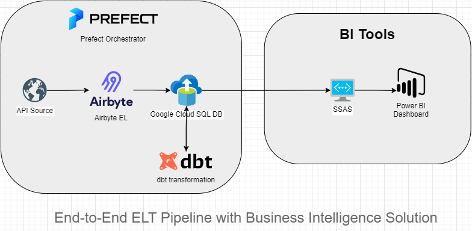

# Enterprise ELT Framework

      

## Project Overview
This project demonstrates an end-to-end Enterprise ELT (Extract, Load, Transform) pipeline from an API source to cloud storage, transformation using dbt, and finally visualization through Power BI connected to an SQL Server Analysis Services (SSAS) cube. This project combines modern data engineering practices with cloud solutions and business intelligence tools.

## Table of Contents
- [Enterprise ELT Framework](#enterprise-elt-framework)
  - [Project Overview](#project-overview)
  - [Table of Contents](#table-of-contents)
  - [Technologies Used](#technologies-used)
  - [Pipeline Steps](#pipeline-steps)
  - [How to Run the Pipeline](#how-to-run-the-pipeline)
  - [How Prefect Works](#how-prefect-works)
  - [Conclusion](#conclusion)

## Technologies Used
- **ETL**: Airbyte 🌀
- **API**: FastAPI 🚀
- **Cloud**: Google Cloud Platform (GCP) ☁️
- **Database**: Google Cloud SQL (MS SQL Server) 🗄️
- **Transformation**: dbt (Data Build Tool) 🔄
- **Containerization**: Docker 🐳
- **Orchestration**: Prefect 🕹️
- **Scripting**: Expect Script for automating keystrokes, PowerShell #️⃣
- **Analytics**: SSAS (SQL Server Analysis Services) 📊
- **Visualization**: Power BI 📈
<br /><br />


## Pipeline Steps
1. **Custom API Connector with Airbyte**: 
    - Created a custom connector in Airbyte to fetch product data from the DummyJSON API using the following configurations:
      - **API URL Path**: `https://dummyjson.com/products?limit=101`
      - **HTTP Method**: `GET`
      - **Primary Key**: `id`
      - **Field Path**: `products`

2. **Destination Connector (Google Cloud SQL)**:
    - The MS SQL connector in Airbyte was used to connect the pipeline to Google Cloud SQL with the following details:
      - **Destination Name**: `GCP SQL`
      - **Database Host**: `Google Cloud SQL instance`
      - **Port**: `1433` (default for MS SQL)

3. **Transformation with dbt**:
    - dbt was used to transform the data after loading it into the cloud database.
    - The data transformations created a new table named `Landing.Products`.

4. **Orchestration with Prefect**:
    - Prefect is an open-source orchestration tool used to manage the ETL pipeline. It enables automation, scheduling, and monitoring of data workflows. 
    - Prefect’s flow orchestrates the following steps:
      1. Trigger the **Airbyte sync** to fetch the data.
      2. Run **dbt transformations** to clean and prepare the data.
      3. Log the success or failure of the data pipeline.

5. **SSAS Tabular Model**:
    - A tabular model was created using SQL Server Analysis Services (SSAS). 
    - Connected the SQL database and loaded the `Landing.Products` table.
    - **DAX (Data Analysis Expressions)** measures were written to analyze the data.

6. **Power BI Visualization**:
    - Power BI connected to the SSAS cube to retrieve both the table data and the DAX measures.
    - Built interactive reports and dashboards for data visualization.

## How to Run the Pipeline
In order to execute the solution, ensure you have the following pre-requisite applications installed on your local machine:
1. **Airbyte Server** must be running.
2. **Docker Desktop** must be installed and running.

To run the pipeline, follow these steps:

1. **Open a terminal** in the project's root directory or navigate (`cd`) to the project's root folder.
2. **Activate the virtual environment**. This is necessary to manage dependencies. If you're using Windows, run:
   ```bash
   .\venv\Scripts\activate
   ```
   This assumes your virtual environment is named `venv`.
3. **Build the Docker image**:
   ```bash
   docker build -t airbyte-dbt-prefect-container .
   ```
   This will build a Docker image using the project files.
4. **Run the Docker container**:
   ```bash
   docker run -it --rm --name airbyte-dbt-prefect -p 8081:4200 airbyte-dbt-prefect-container
   ```
   This command will run the entire pipeline in steps. Here’s what happens:
   - First, the Prefect server will be started.
   - After a 90-second pause, the extraction and loading using Airbyte will be triggered.
   - Then, dbt will run the data transformation as defined in the models, and the final data will be stored in the Google Cloud SQL database.

This is the general process to execute the solution locally. For a detailed explanation of the port bindings, the roles of each file, and further configuration details, refer to the detailed documentation in [ProjectSetupDetails.md](./ProjectSetupDetails.md).

## How Prefect Works
Prefect is a modern workflow orchestration platform that enables us to automate our data pipelines. In this project, Prefect was used to orchestrate the extraction from the API, loading into the database, and transforming the data using dbt. Prefect’s UI allowed us to monitor the pipeline’s progress, view logs, and manage schedules.

- **Flow Definition**: A Prefect flow was created to manage the Airbyte sync and dbt transformation steps.
- **Task Orchestration**: Prefect's task runner ensures that each task, such as triggering an Airbyte sync or running a dbt transformation, runs in the right order.

## Conclusion
This project successfully implements a modern ELT pipeline using Airbyte for data extraction, Google Cloud SQL for storage, dbt for data transformation, SSAS for analytics, and Power BI for visualization. By utilizing Prefect, we ensure a fully orchestrated, automated pipeline that is both scalable and flexible for future enhancements.
